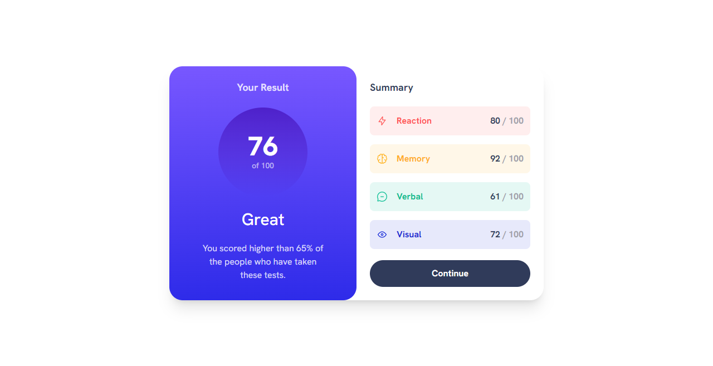

<div align="center">

  

  <h2>Results summary component</h2>

  <h3>
    <a href="https://www.frontendmentor.io/solutions/css-flexbox-UqaHXl-3oY">
      <strong>Frontend Mentor</strong>
    </a>
  </h3>

  <br>

  <div align="center">
    <a href="https://jenacarry.github.io/results-summary-component/">View Demo</a>
    -
    <a href="https://github.com/JenaCarry/results-summary-component/issues">Report Bug</a>
    -
    <a href="https://github.com/JenaCarry/results-summary-component/pulls">Request Feature</a>
  </div>

</div>

#

<div align="center">

  

</div>

This is a solution to the [Results summary component challenge on Frontend Mentor](https://www.frontendmentor.io/challenges/results-summary-component-CE_K6s0maV). Frontend Mentor challenges help you improve your coding skills by building realistic projects. 

<h2>Links</h2>

- Solution URL: [Results summary component | Frontend Mentor](https://www.frontendmentor.io/solutions/css-flexbox-UqaHXl-3oY)
- Live Site URL: [https://jenacarry.github.io/results-summary-component/](https://jenacarry.github.io/results-summary-component/)

<br>

## Table of contents

- [](#)
  - [Table of contents](#table-of-contents)
  - [Overview](#overview)
    - [The challenge](#the-challenge)
    - [Screenshot](#screenshot)
  - [My process](#my-process)
    - [Built with](#built-with)
  - [Useful resources](#useful-resources)
  - [Author](#author)
  - [Run the project](#run-the-project)

## Overview

### The challenge

Users should be able to:

- View the optimal layout for the interface depending on their device's screen size
- See hover and focus states for all interactive elements on the page

### Screenshot



## My process

### Built with

- Semantic HTML5 markup
- Tailwind CSS
- Mobile-first workflow

## Useful resources

- [Tailwind CSS](https://tailwindcss.com/)

## Author

- Frontend Mentor - [@JenaCarry](https://www.frontendmentor.io/profile/JenaCarry)
- LinkedIn - [Jean Dias](https://www.linkedin.com/in/jean-dias-0900a1260/)

## Run the project

To run the client, you need to run the following command:

```bash
npm install
npm run dev
```